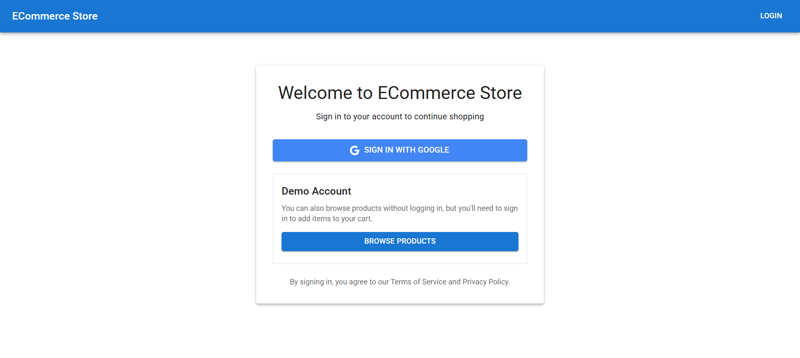
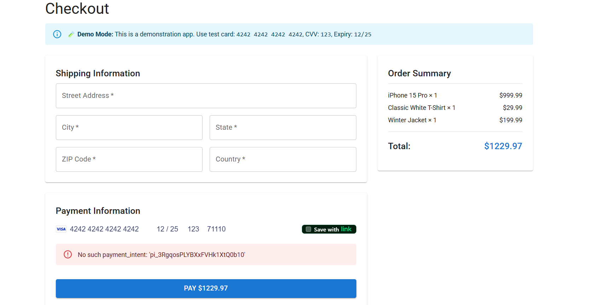
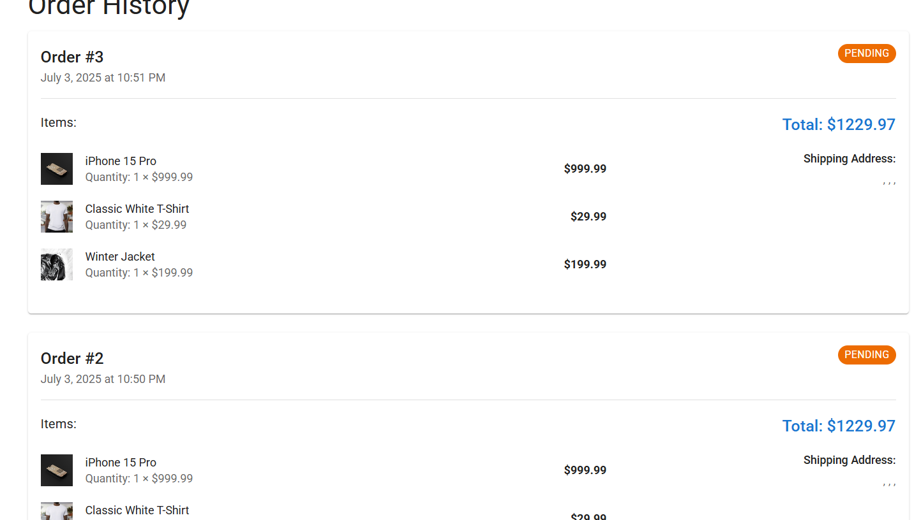

A full-stack e-commerce application built with Java Spring Boot for the backend and React.js for the frontend, featuring OAuth authentication and Stripe payment integration.

## Page to browse products

## Product Page

## Pagination 

## Alert message 

## Login Page and Registration Option

## User Profile Page

## Shopping Cart

## Payment 

## Order History page
